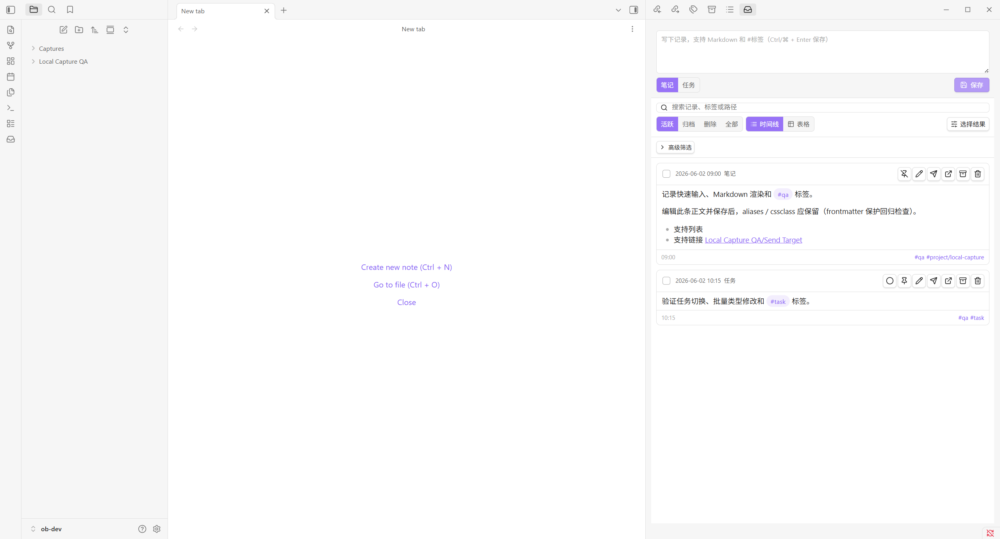
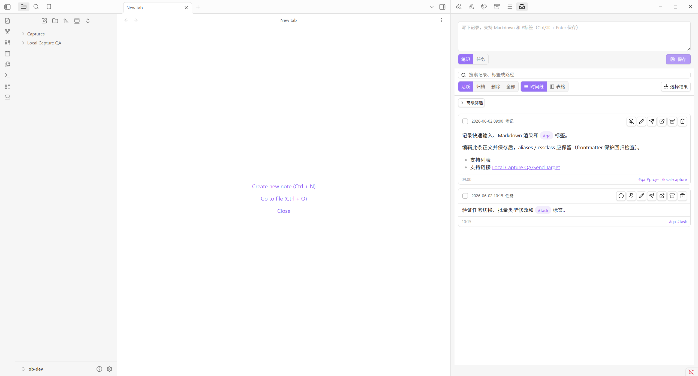
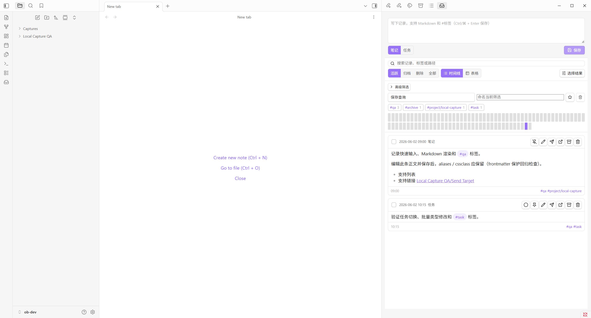
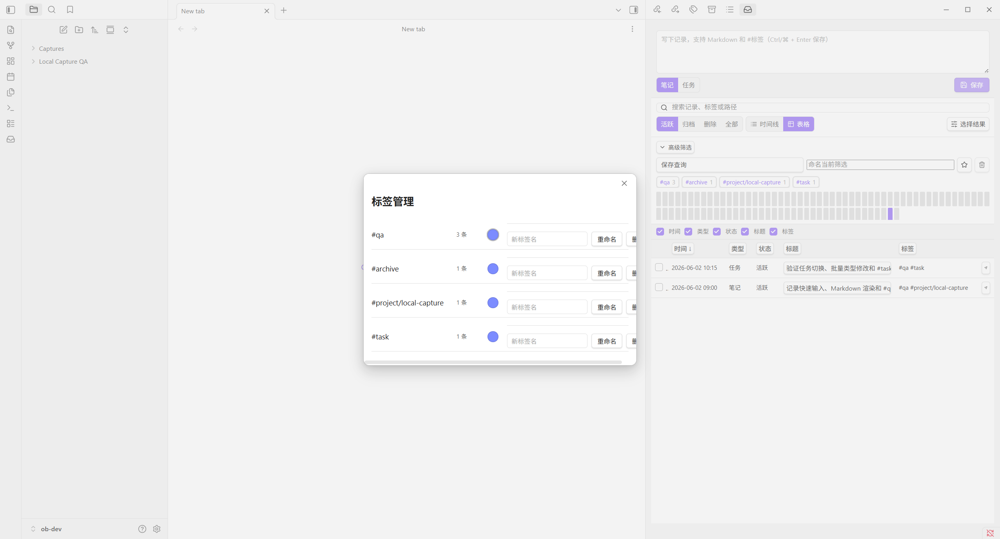

# ob-dev Vault QA

This document records the Local Capture QA pass performed against the real Obsidian vault at `D:\Documents\Projects\ob-dev`.

## Environment

- Vault: `ob-dev`
- Vault path: `D:\Documents\Projects\ob-dev`
- Plugin version: `0.9.2`
- Test date: `2026-06-04` (Asia/Shanghai)
- Install command: `npm run qa:vault -- "D:\Documents\Projects\ob-dev"`

## Automated Checks

The vault QA script installed the plugin, enabled it in `community-plugins.json`, generated capture fixtures, generated a Daily Summary fixture, and wrote a vault-side report to:

`Local Capture QA/QA Report.md`

Script result:

```text
Result: 7/7 checks passed
```

Verified with Obsidian CLI:

```text
plugins filter=community versions format=json
[
  {
    "id": "local-capture",
      "version": "0.9.2"
  }
]
```

```text
commands filter=local-capture
local-capture:archive-selected-captures
local-capture:batch-tag-selected-captures
local-capture:batch-type-selected-captures
local-capture:delete-selected-captures
local-capture:generate-current-day-daily-summary
local-capture:generate-today-daily-summary
local-capture:manage-local-capture-tags
local-capture:new-capture
local-capture:open-local-capture
local-capture:paste-clipboard-capture
local-capture:rebuild-local-capture-index
local-capture:restore-selected-captures
local-capture:run-local-capture-diagnostics
local-capture:send-current-day-summary-to-file
local-capture:send-selected-captures-to-file
```

```text
dev:errors
No errors captured.
```

Note: the vault plugin manifest at `.obsidian/plugins/local-capture/manifest.json` also reports `0.9.2`. The CLI plugin list JSON was used as the version source because the single-plugin detail command can return stale cached metadata immediately after reload.

## Feature Screenshots

### Timeline, Search, Collapsed Advanced Filters



### Expanded Advanced Filters, Saved Queries, Tags, Heatmap



### Table View, Column Controls, Selection



### Tag Management



## Tested Feature Coverage

- Plugin install into `.obsidian/plugins/local-capture`
- Plugin enable and reload through Obsidian CLI
- Runtime version confirmation through Obsidian CLI plugin list JSON
- Sidebar view command: `local-capture:open-local-capture`
- Runtime diagnostics command: `local-capture:run-local-capture-diagnostics`
- Capture indexing from Markdown files under `Captures/`
- Timeline view with rendered Markdown cards
- Status filters for active, archived, deleted, and all captures
- Search input and select-current-results control
- Progressive disclosure for advanced filters
- Saved query controls, tag cloud, and heatmap rendering
- Daily Summary command and generated managed summary block
- Table view switch, row rendering, column visibility controls, and table sorting UI
- Tag management command and modal with counts, color inputs, rename, and delete actions
- Batch actions are visible for selected captures
- No captured runtime errors after opening the view, switching views, opening tag management, and running CLI checks

## Vault Fixtures

Generated fixture files:

- `Captures/2026/06/20260602-090000-qa01.md`
- `Captures/2026/06/20260602-101500-qa02.md`
- `Captures/2026/06/20260602-113000-qa03.md`
- `Captures/2026/06/20260602-130000-qa04.md`
- `Captures/Generated/Daily Summary/2026-06-02.md`
- `Local Capture QA/Send Target.md`
- `Local Capture QA/QA Report.md`

Daily Summary content was verified through the generated fixture and includes the managed block markers:

```text
<!-- local-capture-summary:start 2026-06-02 -->
...
<!-- local-capture-summary:end 2026-06-02 -->
```

## Notes

- The screenshots are real Obsidian screenshots captured through `dev:screenshot`.
- The test did not mutate existing user notes outside the generated `Captures/` and `Local Capture QA/` fixture paths.
- The plugin reported no captured runtime errors after the v0.9.2 QA pass.
